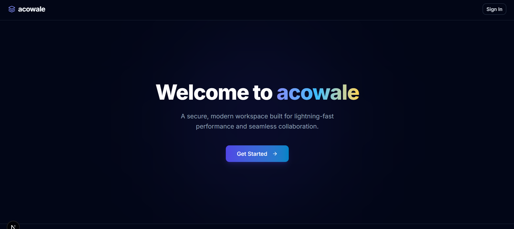
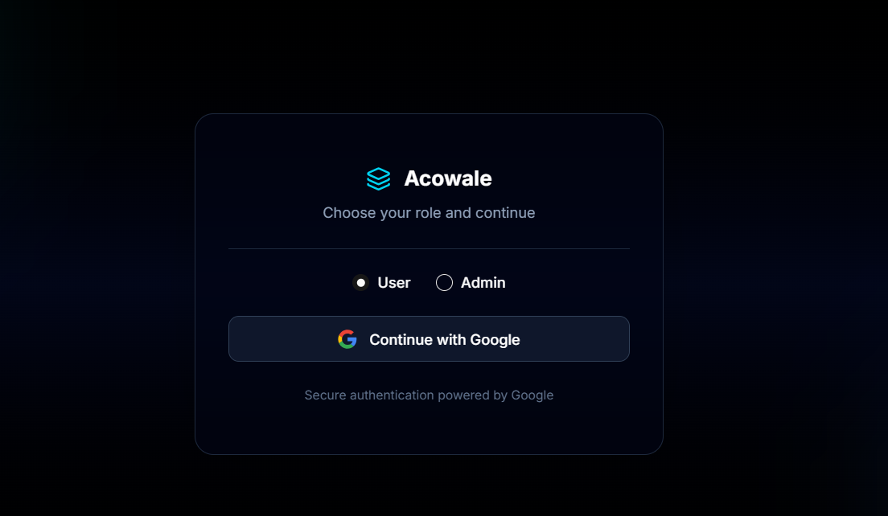
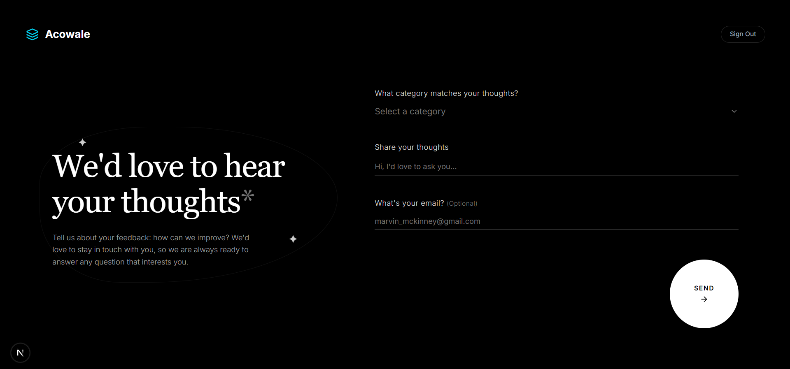
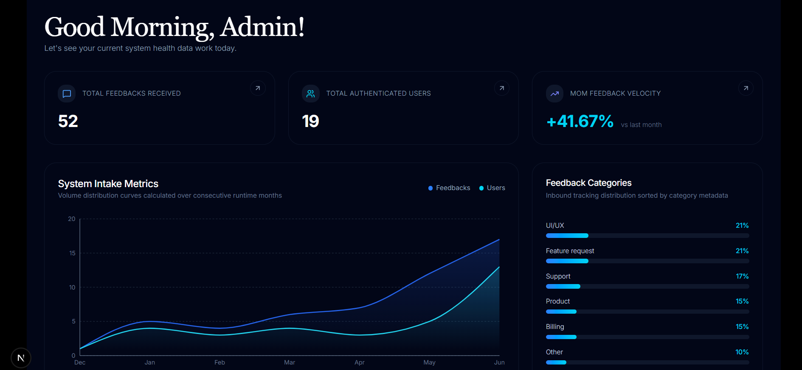
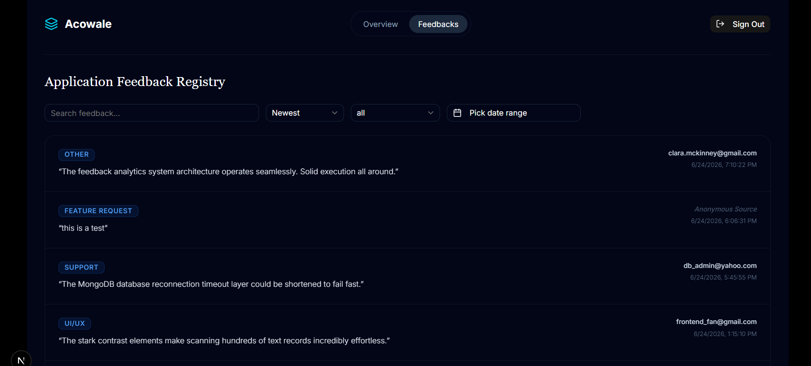

# Acowale CRM – Machine Test

A lightweight customer feedback platform with admin dashboard, built for the Acowale hiring challenge.

**Live Demo:** [Add your URL here]  
**Demo Video:** [Add YouTube/Video link here]  
**Repository:** [https://github.com/Shrey-Raj/acowale-machine-test]

---

## 📌 Overview

This application allows users to submit feedback via a public form and enables admins to view aggregated analytics, filter submissions, and manage feedback. It includes:

- Public feedback submission (name, email, category, comments)
- Admin dashboard with total counts, category distribution, historical trends, and a full feedback table with search, filter, and sort(newest/oldest, category-wise, date-range)
- Authentication via Google OAuth with role selection (Admin/User)
- Secure API routes with global error handling

Built with **Next.js App Router, MongoDB, Tailwind CSS, shadcn UI, and NextAuth.js**.

---

## 🚀 Features

- ✅ **Public Feedback Form** – submit feedback with category, comments, optional email.
- ✅ **Admin Dashboard** – view total feedback, users, growth rate, monthly trends, category breakdown.
- ✅ **Feedback Table** – search, filter by category/date, sort by newest/oldest, pagination.
- ✅ **Authentication** – Google OAuth sign-in, role selection (Admin/User).
- ✅ **Role‑Based Access** – only admins can view the dashboard and analytics.
- ✅ **Global Error Handling** – consistent API error responses and client‑side toasts.
- ✅ **Production Ready** – environment variables, health check, logging.

---

## 🛠️ Tech Stack

| Category          | Technology |
|-------------------|------------|
| **Framework**     | Next.js 15 (App Router) |
| **Language**      | TypeScript |
| **Database**      | MongoDB (Atlas) |
| **ORM/ODM**       | Mongoose |
| **Authentication**| NextAuth.js (Google OAuth) |
| **Styling**       | Tailwind CSS + shadcn/ui |
| **State**         | React Context API |
| **Validation**    | Zod |
| **Deployment**    | Vercel |
| **Proxy (Middleware)** | Next.js proxy (formerly middleware) |

---

## 📦 Getting Started

### Prerequisites

- Node.js (v18+)
- MongoDB Atlas account or local MongoDB instance
- Google OAuth credentials (Client ID & Secret)

### Environment Variables

Create a `.env.local` file in the root directory with the following variables:

```env
# NextAuth
NEXTAUTH_URL=http://localhost:3000
NEXTAUTH_SECRET=your-secret-key-here   # generate with `openssl rand -base64 32`

# Google OAuth
GOOGLE_CLIENT_ID=your-google-client-id
GOOGLE_CLIENT_SECRET=your-google-client-secret

# MongoDB
MONGODB_URI=mongodb+srv://<username>:<password>@cluster0.xxxxx.mongodb.net/acowale_crm?retryWrites=true&w=majority
```

> **Note:** You can copy `.env.example` (included in repo) and fill in your values.

### Installation

```bash
# Clone the repository
git clone https://github.com/Shrey-Raj/acowale-machine-test.git
cd acowale-machine-test

# Install dependencies
npm install

# Run development server
npm run dev
```

Open [http://localhost:3000](http://localhost:3000) in your browser.

---

## 🗂️ Project Structure

```
src/
├── app/
│   ├── api/
│   │   ├── admin/              # Protected admin APIs
│   │   ├── auth/               # NextAuth endpoints + update-role
│   │   └── feedback/           # Public feedback submission
│   ├── dashboard/              # Admin dashboard (protected) | User Feedback Form(accessible to users only)
│   ├── (components)/           # Reusable UI components for the app
│   ├── login/                  # Login page
│   └── page.tsx                # Landing Page (root)
├── components/
│   ├── ui/                     # shadcn components
├── lib/
│   ├── api-handler.ts          # Global error wrapper for API routes
│   ├── api-error.ts            # Custom error classes
│   ├── db.ts                   # MongoDB connection utility
│   └── validations/            # Zod schemas
├── models/                     # Mongoose models (User, Feedback)
├── types/                      # TypeScript type definitions
└── proxy.ts                    # Next.js proxy (authentication redirects)
```

---

## 🔌 API Endpoints

| Method | Endpoint | Description | Auth |
|--------|----------|-------------|------|
| POST | `/api/feedback` | Submit feedback | Public |
| GET | `/api/admin/fetch-feedbacks` | Get feedback list (filter, search, sort, pagination) | Admin |
| GET | `/api/admin/fetch-analytics-summary` | Get dashboard summary stats | Admin |

All admin routes require a valid session with `role: "admin"`. Unauthorized requests receive `401`.

---

We'll add a dedicated **API Data Models** section to the README, explaining the expected request/response structures with validation rules.

---

## 📨 API Data Models

### 1. Public Feedback Submission – `POST /api/submit-feedback`

**Request Body** (JSON)

| Field      | Type     | Required | Validation |
|------------|----------|----------|------------|
| `category` | `string` | ✅ Yes   | Must be one of: `Product`, `Feature request`, `UI/UX`, `Support`, `Billing`, `Other` |
| `comments` | `string` | ✅ Yes   | Min 1 character, max 1000 characters |
| `email`    | `string` | ❌ No    | Optional; must be a valid email format if provided, or empty string |

**Example Request:**

```json
{
  "category": "UI/UX",
  "comments": "The dark mode toggle is not working on mobile.",
  "email": "test@example.com"
}
```

**Response (Success):**

```json
{
  "success": true,
  "data": { "_id": "...", "category": "UI/UX", "comments": "...", "createdAt": "..." },
  "message": "Feedback submitted successfully"
}
```

**Errors:** Returns `400` with validation errors if input is invalid.

---

### 2. Admin Feedback List – `GET /api/admin/fetch-feedbacks`

**Query Parameters** (all optional)

| Parameter  | Type     | Default | Description |
|------------|----------|---------|-------------|
| `page`     | `number` | `1`     | Page number (1‑based) |
| `limit`    | `number` | `10`    | Items per page (max 100) |
| `search`   | `string` | –       | Case‑insensitive search in `comments` |
| `sort`     | `string` | `newest`| Sort order: `newest` or `oldest` |
| `category` | `string` | –       | Exact match on category |
| `from`     | `string` | –       | Start date in `YYYY-MM-DD` format (UTC) |
| `to`       | `string` | –       | End date in `YYYY-MM-DD` format (UTC) |

**Example Request:**

```
GET /api/admin/fetch-feedbacks?page=2&limit=5&category=UI/UX&search=dark&from=2026-01-01&to=2026-06-30
```

**Response:**

```json
{
  "success": true,
  "data": {
    "feedbacks": [ /* array of feedback objects */ ],
    "pagination": {
      "page": 2,
      "limit": 5,
      "total": 42,
      "totalPages": 9
    }
  },
  "message": "Feedbacks fetched successfully"
}
```

**Errors:** Returns `400` with details if query parameters fail validation (e.g., invalid date format).

---

### 3. Analytics Summary – `GET /api/admin/fetch-analytics-summary`

No request parameters. Response structure:

```json
{
  "totalFeedbacks": 2458,
  "totalUsers": 1546251,
  "unresolvedCount": 56489,
  "growthRate": "+4.43%",
  "historicalData": [
    { "month": "Jan", "feedbacks": 400, "users": 240 },
    ...
  ],
  "categoryDistribution": [
    { "name": "UI/UX", "value": 45 },
    ...
  ]
}
```

This endpoint aggregates data from all feedback documents.

---

### Validation Rules (Zod)

All API inputs are validated using **Zod**. The schemas live in `src/lib/validations/` and guarantee strict type safety and clear error messages.

- **Feedback Submission:** Enforces allowed category values, required comments, and optional valid email.
- **Feedback Filter:** Ensures `page` and `limit` are positive integers, `sort` is one of two values, and dates (if provided) are in `YYYY-MM-DD` format.

---


## 🚢 Deployment

### Deploy to Vercel (recommended)

1. Push your code to a GitHub repository.
2. Go to [Vercel](https://vercel.com) and import the project.
3. Add the environment variables in the Vercel dashboard.
4. Deploy.

---

## 📸 Screenshots

**Landing Page:**  


**Login Page:**  


**Public Feedback Form:**  


**Dashboard – Analytics:**  


**Feedback Table:**  


---


## 🙏 Acknowledgements

- [Acowale](https://acowale.com) – for the challenge and inspiration.
- [shadcn/ui](https://ui.shadcn.com) – beautiful components.
- [Next.js](https://nextjs.org) – the React framework.

---

## 👤 Author

**[Shrey Raj Chaudhari]** – [https://github.com/Shrey-Raj]  
Built as part of the Acowale Machine Test.

---

**End of README**